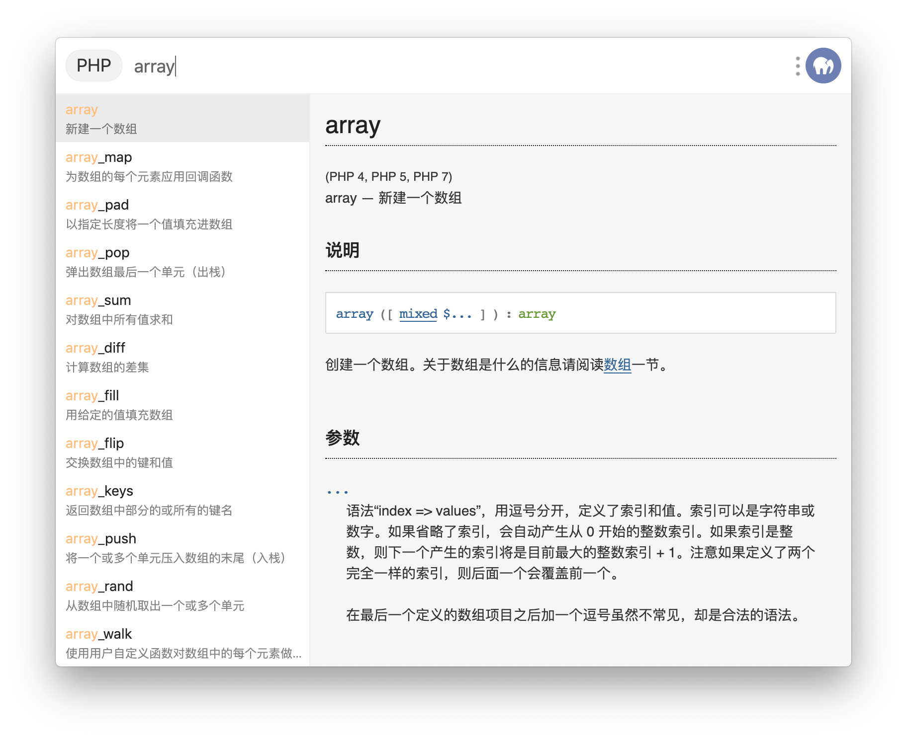

# 模板插件

uTools 的插件开发给予了开发者最大的自由度，你可以随心所欲的设计页面结构、样式、交互，对于特别擅长前端开发的同学，这没有什么问题，但对于非前端开发者，要做出漂亮的、高质量的前端UI是一件困难的事情。

我们发现在uTools使用环境中，很多插件的场景都有其共性，所以我们抽象出一套体验统一、高质量、高性能的通用模版，如果你想开发的插件场景适合使用此模版，那么你只需提供数据并提供一些回调函数即可。

### plugin.json 文件

要使用uTools模版，首先第一步就是删除`plugin.json`文件中的`main`属性。

<s>`"main": "index.html"`</s>


### preload.js 文件

```js
...
 其他 js 代码
...

// 在window上添加一个名称为“exports”的对象，用于描述插件的模版模式及设置回调
// 无UI模式
window.exports = {
   "features.code": { // 注意：键对应的是plugin.json中的features.code
      mode: "none",  // 用于无需UI显示，执行一些简单的代码
      args: {
         // 进入插件时调用
         enter: (action:{ code, type, payload }) => {
           window.utools.hideMainWindow()  
           // do some thing
           window.utools.outPlugin()
         }  
      } 
   }
}

// 列表模式
window.exports = {
   "features.code": { // 注意：键对应的是plugin.json中的features.code
      mode: "list",  // 列表模式
      args: {
         // 进入插件时调用（可选）
         enter: (action, callbackSetList) => {
           // 如果进入插件就要显示列表数据
           callbackSetList([
               {
                   title: '这是标题',
                   description: '这是描述',
                   icon:'' // 图标(可选)
               }
           ])
         },
         // 子输入框内容变化时被调用 可选 (未设置则无搜索)
         search: (action, searchWord, callbackSetList) => {
           // 获取一些数据
           // 执行 callbackSetList 显示出来
           callbackSetList([
               {
                   title: '这是标题',
                   description: '这是描述',
                   icon:'' // 图标，
                 	 url: 'https://yuanliao.info',
                   other: 'xxx'
               }
           ])
         },
         // 用户选择列表中某个条目时被调用
         select: (action, itemData, callbackSetList) => {
           window.utools.hideMainWindow()
           const url = itemData.url
           require('electron').shell.openExternal(url)
           window.utools.outPlugin()
         },
         // 子输入框为空时的占位符，默认为字符串"搜索"
         placeholder: "搜索"
      } 
   }
}
// 文档模式
window.exports = {
   "features.code": { // 注意：键对应的是plugin.json中的features.code
       mode: "doc", // 文档模式
       args: {
          // 索引集合
          // indexes: require('./indexes.json')
          indexes:[
            {
                t: '这是标题',
                d: '这是描述'.
                p: 'doc/xxx.html' //页面, 只能是相对路径
            }
          ],
          // 子输入框为空时的占位符，默认为字符串"搜索"
          placeholder: "搜索"
       }
   }
}
```


## 示例项目

### 无UI + 列表模式

- Chrome 小助手  https://github.com/in3102/utools-chrome_helper


### 文档模式

- MDN 文档（包含 JavaScript、Html、CSS、Web API/DOM、HTTP）  https://github.com/in3102/utools-mdn-doc
- Python 文档 https://github.com/in3102/utools-python-doc
- Linux 命令文档 https://github.com/in3102/utools-linux-doc
- PHP 文档 https://github.com/in3102/utools-php-doc

## UI展示



