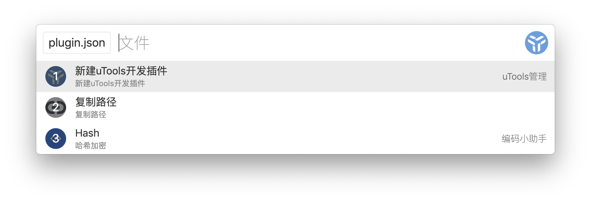
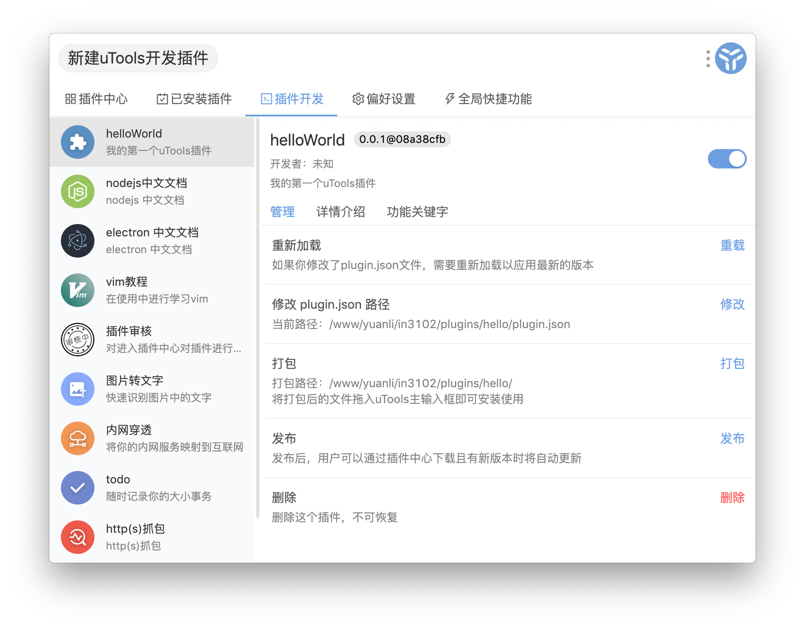
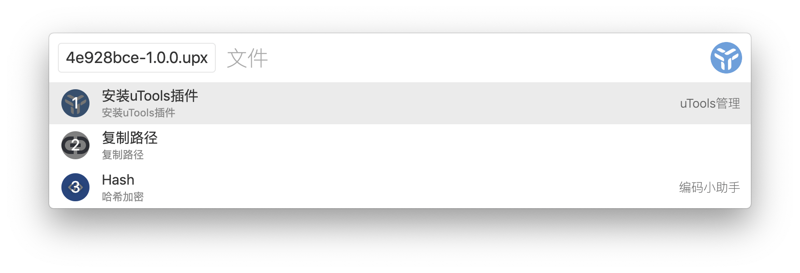

# 快速上手

hey，开发者，终于和你见面了。

从这里开始，你将了解如何从零开始创造一个uTools插件。这是非常容易的事情，你不必学习一些特有的无法应用在其他领域的知识，只需要使用你已经熟悉的技术（Javascript、HTML、CSS），如果你了解一些 Nodejs 的相关API，那将再好不过，它能够与本地操作系统有更多的交互，实现更为强大的功能。

## plugin.json

在你觉得合适的地方新建一个文件夹，并创建`plugin.json`文件。这是最重要的一个文件，用来说明这个插件将如何与 uTools 集成，最基本的格式如下：

```json
{
	"pluginName": "helloWorld",
	"description": "我的第一个uTools插件",
	"main": "index.html",
	"version": "0.0.1",
	"features": [
		{
		  "code": "hello",
		  "explain": "hello world",
			"cmds":["hello", "你好"]
		}
	]
}
```
#### 字段说明

`pluginName` : 插件名称，它会在uTools的很多地方出现

`description` : 插件描述，简洁的说明这个插件的作用

`main` : 入口文件，如果没有定义入口文件，此插件将变成一个[模版插件](tpl.html)

`version` : 插件的版本，需要符合Semver(语义化版本) 规范。一般情况下形如：`主.次.修订` 即可

`features ` : 唯一比较复杂的就是features了，首先它是一个数组，每个数组元素用来描述这个插件提供的一个相对独立的功能，例如uTools中的「编码小助手」插件，提供了`md5` 、 `时间戳` 、 `随机数` 等功能。

`features.code` : 插件某个功能的识别码，在进入插件时会传递给你的代码，可用于区分不同的功能，显示不同的UI

`features.cmds` : 通过哪些方式可以进入这个功能，中文会自动添加 `拼音`及`拼音首字母`

#### 创建入口文件
根据`main`中的定义，在plugin.json的同级目录，创建一个`index.html`文件：
```html
<!DOCTYPE html>
<html>
<body>
hello world
</body>
</html>
```

## 开发者中心
好了，一个hello world插件已经开发好了，我们让它集成到uTools中。

1. 复制`plugin.json`文件，呼出uTools，选择「创建一个uTools插件」，uTools会自动开启`开发者`标签，并提供相应的管理功能。



2. 点击 启用 图标，退出插件中心，在uTools中输入`hello`， `你好`，`nh` 均可以到达你的插件


3. 当你已经实现了插件所需的功能，通过「开发者」管理界面，点击「打包成uTools插件」，就可以获得一个打包好的`.upx`文件，复制或拖入 uTools主输入框中即可以进行安装。



