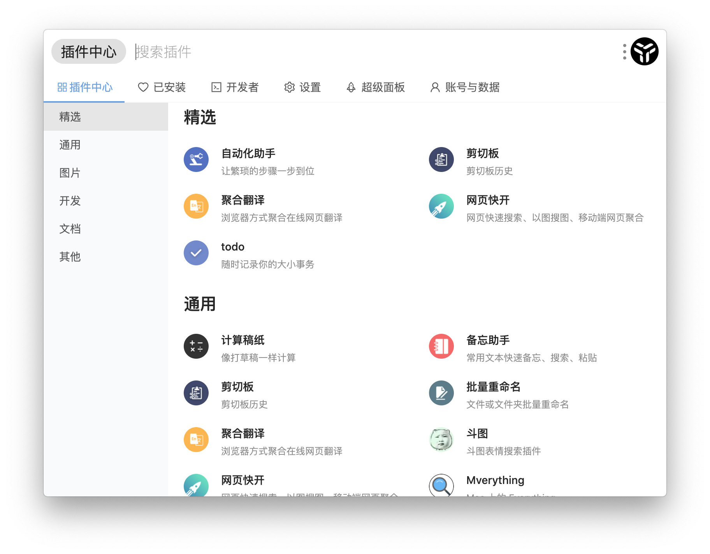

# 介绍

## uTools是什么？

uTools是一个极简、插件化、跨平台的现代化桌面软件。通过自由选配丰富的插件，打造你得心应手的工具集合。

通过快捷键（默认`alt+space`）就可以快速呼出这个搜索框。它相当聪明，可以支持输入、拖拽、自动粘贴等作为输入源，相应的插件也早已准备就绪，统一的设计风格和操作方式，助你高效的得到结果。

当你熟悉它后，能够为你节约大量时间，让你可以更加专注地改变世界。
## uTools能做什么？
最简单的，uTools可以作为一个程序快速启动器，支持英文、英文驼峰、中文拼音、拼音首字母来打开你的本地程序。除程序外，win10和mac用户还可以快速搜索并打开「控制面板」内的细项。总之，你只要还记得一个大概的名字，直接输入基本都能找到。
> 针对中文特别优化，例如可以通过搜索`记事本`或`jsb`打开记事本，而不是搜索`notepad`

程序启动器仅仅是最基础的功能，uTools最大的特点就是拥有强大的插件系统，每个插件都有简洁美观、易于操作的界面，输入`plugins`进入插件管理，你就可以根据自己的需求挑选安装，组合成自己最趁手的工具合集，为各种日常操作提供便利。不断产生的新插件，也将为你带来无限可能。

## 特性

* **插件化：** 优秀的插件化设计，自取所需。每个插件解决一个具体场景的问题，简洁易用、随用随走。

* **多功能输入框：** 支持文本、截图、图片、文件、文件夹

* **自动识别：** 自动识别文本类型（json、base64、时间戳等）

* **自动粘贴：** 呼出uTools时，如果剪切板中5秒内有新的内容，将自动粘贴到输入框

* **全局快捷键：** 配合插件，可一键上传截图到图床、以图搜图、翻译剪贴板内容等

* **数据同步：** 云端同步，永不丢失

  
## 联系方式

猿料社区：[https://yuanliao.info](https://yuanliao.info)
> 任何 bug、建议、想法，欢迎在社区发布，以便我们有针对性的回复及整理

微信群(群人数限制，将邀请你加入群聊)：

欢迎关注「猿料」公众号(插件推荐、开发故事)：

## 截图预览
 **插件管理**
 
 

